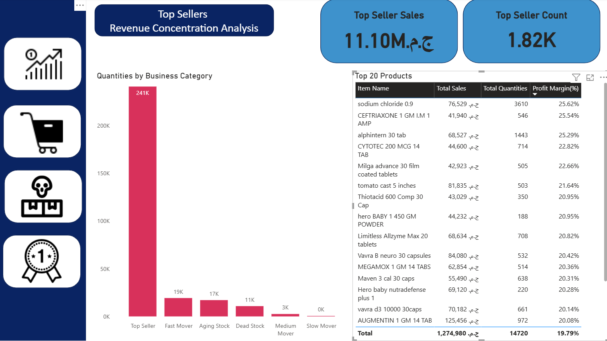
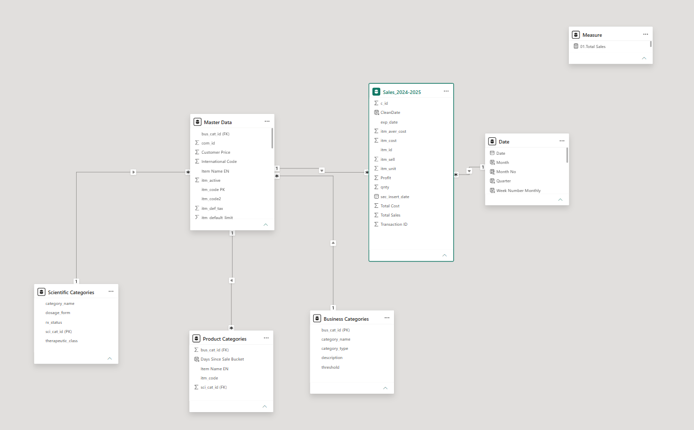

# Cairo-Pharmacy-Analysis
A complete pharmacy business intelligence system built on real operational data from an active retail pharmacy in Cairo, Egypt. This project analyzes 18,835 pharmaceutical products and 288,000 sales transactions across 2024–2025 to deliver actionable inventory management and revenue insights.
# Pharmacy Analytics Dashboard
### Business Intelligence System — Cairo Retail Pharmacy

## Overview
A complete pharmacy BI system analyzing real operational 
data from an active Cairo retail pharmacy. Built to solve 
real inventory and revenue problems — not a tutorial project.

**18,835 products | 288K transactions | 2024–2025**

## Business Problem
The pharmacy needed answers to 4 critical questions:

1. Where is our revenue actually coming from?
2. How much capital is sitting in unsold inventory?
3. Which products should we reorder vs discontinue?
4. What does our stock movement pattern look like?

## Dashboard Screenshots

### Page 1 — Sales Performance

### Page 2 — Movement Analysis

### Page 3 — Dead Stock Alert

### Page 4 — Top Sellers

### Data Model

## Key Findings

| Finding | Value |
|---------|-------|
| Total Revenue | 15M ج.م |
| Net Profit | 3.4M ج.م |
| Profit Margin | 22.12% |
| Dead Stock Value | 676,000 ج.م |
| Dead Stock Products | 844 items (90+ days) |
| Aging Stock Products | 3,000+ items (180+ days) |
| Top Seller Revenue Share | 74% from 7.4% of catalog |
| #1 Revenue Product | Augmentin 1GM |
| Seasonal Pattern | Q3/Q4 revenue spike confirmed |

## Data Model

Snowflake schema with 5 connected tables:
**Tables:**
- **Sales_2025** — 288K transaction records
- **Master Data** — Product details, pricing, active status
- **Product Categories** — FK bridge table (sci_cat_id + bus_cat_id)
- **Scientific Categories** — 24 medical/therapeutic categories
- **Business Categories** — 9 custom performance tiers

## Business Category Framework

Custom thresholds built from actual sales distribution 
percentiles — not arbitrary cutoffs:

| Category | Threshold | Products | Revenue |
|----------|-----------|---------|---------|
| Top Seller | ≥62 units | 1,820 (7.4%) | 11.1M ج.م |
| Fast Mover | 17–62 units | 2,065 (8.4%) | 1.7M ج.م |
| Medium Mover | 5–17 units | 11,403 (46%) | 0.3M ج.م |
| Slow Mover | <5 units | 413 (1.7%) | 0.0M ج.م |
| Dead Stock | No sales 90+ days | 844 (3.4%) | — |
| Aging Stock | No sales 180+ days | 2,959 (12%) | — |

## Dashboard Pages

### Page 1 — Sales Performance Overview
- Total Revenue, Net Profit, Profit Margin, 
  Transactions, Quantities
- Revenue trend by quarter (Q1–Q4)
- Top 10 products by revenue
- Month slicer for period filtering

### Page 2 — Movement Analysis
- Product count by movement tier (donut chart)
- Revenue by movement category (bar chart)
- Dead stock count and value KPI cards
- Instant visual of revenue concentration problem

### Page 3 — Dead Stock Alert
- Complete dead stock product list with last sale date
- Days-since-sale distribution chart
- - Clearance priority ranking by value

### Page 4 — Top Sellers Analysis
- Top Seller Sales: 11.10M ج.م
- Top Seller Count: 1,820 products
- Revenue by business category
- Top 20 products table with margin analysis

---

## DAX Measures (12 Custom)

01. Total Sales = SUM(Sales_2025[itm_cost])
02. COGS = SUM(Sales_2025[itm_aver_cost])
03. Net Profit = [Total Sales] - [COGS]
04. Profit Margin% = DIVIDE([Net Profit],[Total Sales])
05. ROI = DIVIDE([Net Profit],[COGS])
06. Total Transactions = COUNTROWS(Sales_2025)
07. Unique Transactions = DISTINCTCOUNT(Sales_2025[c_id])
08. Unique Orders = DISTINCTCOUNT(Sales_2025[itm_id])
09. Average Sale = DIVIDE([Total Sales],[Total Transactions])
10. Total Quantities = SUM(Sales_2025[Quantity])
11. Dead Stock Count = CALCULATE(COUNTROWS('Product Categories'),
                       'Product Categories'[bus_cat_id]=5)
12. Dead Stock Value = CALCULATE([Total Sales],
                       'Product Categories'[bus_cat_id]=5)

## Tools Used

| Tool | Purpose |
|------|---------|
| SQL | Data extraction + aggregation from pharmacy system |
| Power Query | Table joins + data transformation |
| Power BI Desktop | Data model + dashboard |
| DAX | 12 custom business measures |
| Excel | Category lookup tables |

## Skills Demonstrated

- Relational data modeling (snowflake schema)
- Power Query M transformations
- DAX measure development
- Business category framework design
- Pharmaceutical domain analysis
- Inventory optimization methodology
- Executive dashboard design
- Bookmark-based navigation

## About the Analyst

Licensed pharmacist with 4+ years of operational pharmacy 
experience, combining pharmaceutical domain expertise with 
data analytics skills to solve real healthcare business 
problems.

This project uses real data from a live operational pharmacy 
— not a tutorial dataset. Every insight reflects actual 
business conditions in the Egyptian pharmaceutical retail market.

**Skills:** SQL | Power BI | Power Query | DAX | Python (in progress)

**Domain:** Pharmaceutical | Healthcare | Retail Analytics

## Version 2 — In Progress

- [ ] Full scientific categorization (24 therapeutic classes)
- [ ] Drill-through pages for product-level analysis  
- [ ] Python demand forecasting model
- [ ] Tooltip pages for enhanced interactivity
- [ ] Supplier performance analysis
- [ ] Reorder point optimization model

---

## Connect

www.linkedin.com/in/youssef-rashed-43a0391a0
youssefrashed1@gmail.com
